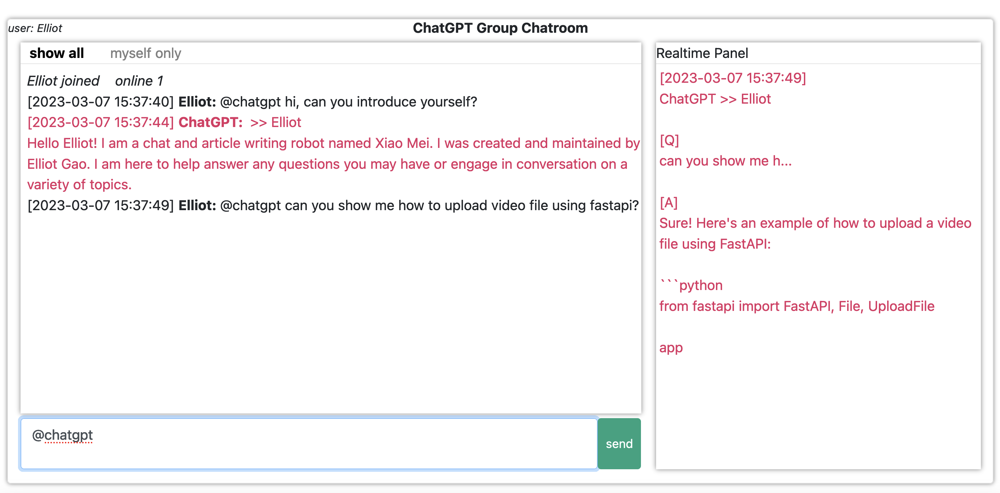

## Chatgpt-FastAPI 

[中文](./README_CN.md)

If you are a python person, and looking for a simple web interface to try out OpenAI chatgpt API, then this is the repo for you. 

This is a python one-stop shop project, I built it myself for the sake of trying out different context/prompt engineering. Hope you will find it useful.

## System Requirement

Tested on `MacOS` and `Ubuntu20 LTS`

Python version `== python3.8`

<i>Technically, it should work on `>= python3.7`, but you will have to edit the module versions accordingly in `install.sh` file</i>

## Installation
1. At project root, create and enter a `python3.8` virtual environment
```
cd $PROJECT_ROOT
python3.8 -m venv venv
source venv/bin/activate
```

2. One bash script installation for all
```
bash ./install.sh
```

## Start Server

Visit openai to obtain your [API key](https://platform.openai.com/account/api-keys) and [Organization ID](https://platform.openai.com/account/org-settings)

Then export to env variable
```
export OPENAI_API_KEY="sk-abcdef..."
export OPENAI_ORG_ID="org-zxcvbb..."
```

Start the server using bash script
```
bash ./app.sh start --host 0.0.0.0 --port 8080
```

You should see the below sample stdout
```
INFO:     Waiting for application startup.
INFO:     Application startup complete.
INFO:     Uvicorn running on http://0.0.0.0:8080 (Press CTRL+C to quit)
chatgpt launched
--------------------------
```

Note that this server is detached from your terminal, you're free to close the terminal without interrupting the service.

To stop the server, execute `bash ./app.sh stop`

Now, open web browser and visit http://0.0.0.0:8080. Enjoy



## Switch Language
To change language, you will need to edit both the web text (under `./config`) and chatgpt prompts (under `./prompts`). There are at
```
./config
├── config_en.py
└── config_zh.py

./prompts
├── prompts_en
│   ├── chat-agent.txt
│   └── context-summarizer.txt
└── prompts_zh
    ├── chat-agent.txt
    └── context-summarizer.txt
```

then, change the import in `main.py:33`
```
from config.config_en import Args
# from config.config_zh import Args
```

## Common Issues
to be added

## Credits
1. this project was built upon <br> https://medium.com/@ahtishamshafi9906/how-to-build-a-simple-chat-application-in-fastapi-7bafad755654
2. spinning donut <br> https://www.a1k0n.net/2011/07/20/donut-math.html

## License

This project is licensed under the [MIT License](LICENSE).