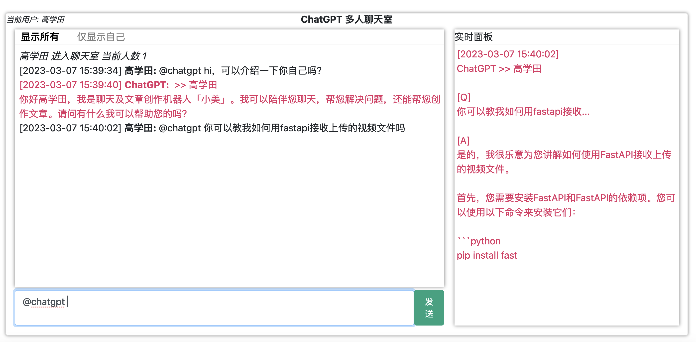

## Chatgpt-FastAPI

[English](./README.md)

如果你是一个 Python 爱好者，正在寻找一个简单的网络界面来试用 OpenAI Chatgpt API，那么这个仓库就是为你准备的。

这是一个 Python 的一站式项目。 我个人为了尝试不同的上下文/提示工程而构建了它。 希望这个项目能帮助到您。



## 系统要求

在`MacOS`和`Ubuntu20 LTS`上进行了测试

Python 版本 `== python3.8`

<i>理论上，它能支持`>=python3.7`版本，但是您将不得不相应地编辑`install.sh`中各个模块版本版本号</i>

## 安装

1. 于项目根目录创建并进入`python3.8`虚拟环境
```
cd $PROJECT_ROOT
python3.8 -m venv venv
source venv/bin/activate
```

2. 通过脚本一键安装pip模块
```
bash ./install.sh
```

## 启动服务器

访问 openai 以获取您的 [API 密钥](https://platform.openai.com/account/api-keys) 和[组织 ID](https://platform.openai.com/account/org-settings)

然后导出到环境变量
```
export OPENAI_API_KEY="sk-abcdef..."
export OPENAI_ORG_ID="org-zxcvbb..."
```

使用 bash 脚本启动服务器
```
bash ./app.sh start --host 0.0.0.0 --port 8080
```

您应该会看到下面的样本标准输出
```
INFO:     Waiting for application startup.
INFO:     Application startup complete.
INFO:     Uvicorn running on http://0.0.0.0:8080 (Press CTRL+C to quit)
chatgpt launched
--------------------------
```

请注意，此服务器已与您的终端分离，您可以在不中断服务的情况下关闭终端。

要停止服务器，请执行 `bash ./app.sh stop`

现在，打开浏览器并访问 http://0.0.0.0:8080。 享受吧！

## 切换语言

<br>第1步：创建您自己的`config_lang.py`，类似于以下文件
```
./config
├── config_en.py
└── config_zh.py
```

<br>第2步：相应地更改`main.py: 32`中的导入
```
from config.config_en import Args
＃from config.config_zh import Args
```

<br>第3步：创建自己的prompt提示文件，按以下方式排列
```
./prompts
├── prompts_en
│   ├── chat-agent.txt
│   └── context-summarizer.txt
└── prompts_zh
    ├── chat-agent.txt
    └── context-summarizer.txt
```

<br>第4步：编辑第1步中创建的`config_lang.py`，确保其`PROMPTS_DIR`赋值了正确的目录路径。还要编辑所有与消息相关的变量（第30至50行）。用您想要的文本替换它们。

## 常见问题
待添加

## 致谢
1. 这个项目是在这个帖子的基础上搭建的 <br> https://medium.com/@ahtishamshafi9906/how-to-build-a-simple-chat-application-in-fastapi-7bafad755654
2. 旋转甜甜圈 <br> https://www.a1k0n.net/2011/07/20/donut-math.html


## 许可证

本项目使用 MIT 许可证许可。